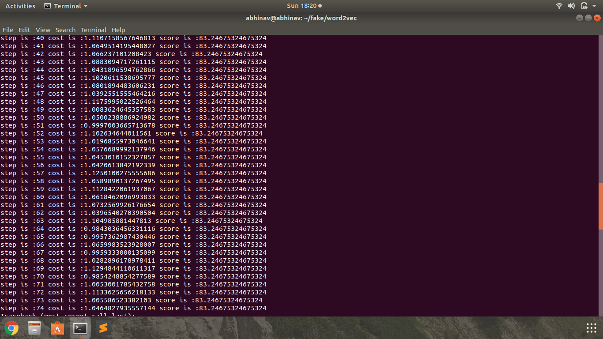

# Automatic Stance Detection

## Things done

* Data preprocessing   
* lstm architecture defined  

## ALgorithms

* **[Lstm](https://colah.github.io/posts/2015-08-Understanding-LSTMs/)**

## Approach

1. Created word vectors of the headline and body separately using the GoogleNews word embeddings and make the feature matrix for the same.

2. We used the following model specifications while designing the model.
```
        learning_rate = 0.01
        epochs = 10
        training_iters = 100000
        batch_size = 50

        *Network Parameters*
        input_dimension = 300
        inputs_to_hidden = 100
        number_of_output_classes = 4
```
3. Using Two basic LSTM cell with **AdamOptimizer** for headline and body_lengths getting the word vector as input it will self generate it's features and creates the accuracy score learned from the vectored input.

The result obtained is as




### Execution

Clone this repository and download 'google news vectors negative 300' from **[here](https://s3.amazonaws.com/dl4j-distribution/GoogleNews-vectors-negative300.bin.gz)** and put it inside the word2vec folder.
Now execute execute lstm.py file
